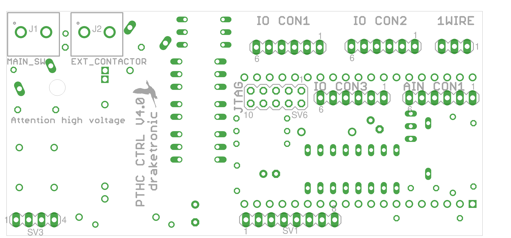
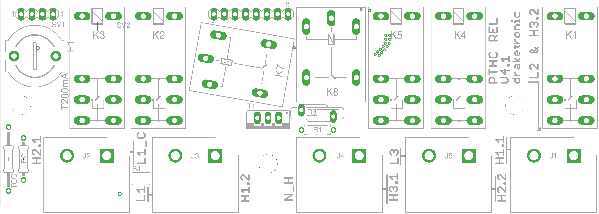

# Assembly and Mounting Instructions for "Esphome PTHC"

---

## ⚠️ Disclaimer

**Important Note:**  
This kit is intended exclusively for experienced users with knowledge in electronics development.

This guide outlines a possible example for assembling electronic components that are available separately.  
This is **not a finished product**, but a technical documentation for **independent implementation** by the user.

---

## ❗ Warning: Working with Mains Voltage

If this guide includes circuits powered by or connected to **mains voltage**, the following applies:

- Working with mains voltage poses a **serious risk of electric shock**.
- Improper assembly or usage can result in **injuries, fires, or fatal accidents**.
- Components carrying mains voltage must be **installed, inspected, and operated only by qualified professionals**.
- If in doubt, **do not attempt it yourself** – consult a licensed electrician.

---

## ⚠️ General Information

1. The supplied components do **not** constitute a complete, tested, or safe device.
2. Assembly is done **entirely at your own risk and responsibility**.
3. No warranty or liability is assumed for any damage resulting from reproduction, operation, malfunction, or improper handling of the instructions or components.
4. This guide is intended **solely for demonstration, educational, and research purposes**.
5. Use in safety-critical areas (e.g. medical, aviation, automotive) is **strictly prohibited**.

---

## 🛡️ Liability Disclaimer

This circuit is a DIY project and serves as a "proof of concept". It has not been tested or certified for compliance with standards. Reproduction is at your own risk.  
This kit does not constitute a finished electrical product. No electronic device will be shipped. Assembly is at your own risk.  
No liability is accepted for any damage or accidents resulting from incorrect assembly or improper use.  
By purchasing or using this guide, you expressly accept this disclaimer.

---

## Introduction

This guide walks you through the step-by-step population and assembly of the PCB, as well as the final installation of the system.  
It is particularly suitable for beginners and includes additional explanations for each step.

---

## Required Tools

- Soldering station or soldering iron
- Solder
- Side cutter
- Multimeter
- Rotation direction indicator, e.g. SM852B

---

## Required Installation Material

- PTHC kit and optional components → www.draketronic.de
- Cable glands
- Appropriate cable material (see tables below)
- 3-phase heating element (max. power in delta connection)
- 3-pole circuit breaker
- 3-pole residual current circuit breaker (RCD)
- ESP32-DevKitC, optionally ESP32-DevKitC-32U with external antenna
 
# Step-by-Step Assembly: "PTHC_CTRL_BRD"

## PCB Top Side:

## PCB Bottom Side:

---

### Step 1: Solder the Resistors

Resistors are non-polarized and can be inserted in either direction. Their values are typically indicated by colored rings. Alternatively, you can verify them with a multimeter.

| Component | Value | Type      | Color Bands                          |
|-----------|-------|-----------|--------------------------------------|
| R1        | 33Ω   | Resistor  | Orange - Orange - Black - Gold       |
| R3        | 51kΩ  | Resistor  | Green - Brown - Orange - Gold        |
| R5        | 440Ω  | Resistor  | Yellow - Yellow - Brown - Gold       |
| R6        | 10kΩ  | Resistor  | Brown - Black - Orange - Gold        |

Insert the resistors according to the markings (R1, R3, R5, R6) on the PCB, solder them, and trim the leads with side cutters.  
If you're unsure, verify each value using a multimeter.

---

### Step 2: Install the Varistor

A varistor protects the circuit from overvoltage.

| Component | Value    | Type     |
|-----------|----------|----------|
| R2        | 10D561K  | Varistor |

Install the varistor in position R2. It is non-polarized and can be mounted in either direction.

---

### Step 3: Solder the Capacitors

⚠️ **Note:** Electrolytic capacitors (polarized) have polarity. Pay attention to the markings (+/−).

| Component | Value  | Polarized |
|-----------|--------|-----------|
| C1        | 330µF  | Yes       |
| C2        | 100nF  | No        |
| C3        | 220µF  | Yes       |
| C4        | 1µF    | No        |
| C5        | 1µF    | No        |
| C6        | 330µF  | Yes       |

Start with the non-polarized capacitors (C2, C4, C5), then install the polarized ones (C1, C3, C6).  
Ensure correct polarity (negative stripe on the capacitor housing).

---

### Step 4: Solder the Diodes

Diodes are polarized. Match the diode's stripe to the marking on the PCB.

| Component | Value     | Type     |
|-----------|-----------|----------|
| D1        | SR160     | Diode    |
| D2        | BZX85C43  | Zener Diode |

---

### Step 5: Install Inductors

Inductors (coils) are not polarized.

| Component | Value               | Type         |
|-----------|---------------------|--------------|
| L1        | PDUUAT98-103MLN     | Choke        |
| L2        | PDSH0512I-680M      | Inductor     |
| L4        | PDSH0512I-680M      | Inductor     |

---

### Step 6: Insert ICs and Optocouplers

Pay close attention to orientation (notch or dot marker) when inserting ICs.

| Component | Value        | Type         |
|-----------|--------------|--------------|
| IC2       | TBD62003APG  | Driver IC    |
| OK1       | 814B         | Optocoupler  |
| OK2       | VO3023       | Optocoupler  |

---

### Step 7: Install Transistor

Insert the transistor according to the shape shown on the PCB marking.

| Component | Value            | Type       |
|-----------|------------------|------------|
| Q2        | GOFORD G01N20RE  | Transistor |

---

### Step 8: Install Power Supply Module

| Component | Value          | Type            |
|-----------|----------------|-----------------|
| PS2       | R02-T2S05-H    | Power Supply Module |

---

### Step 9: Mount ESP32 Module

The U1 module (ESP32-DevKitC) is mounted via sockets.  
Solder two 19-pin female headers in the designated positions. Then plug in the ESP32 module – allowing easy replacement if needed.

---

### Step 10: One-Wire Bus for Temperature Sensor (Optional)

The one-wire bus lets you connect a digital temperature sensor.  
Solder R4 and SV4. SV4 is mounted on the bottom side of the board with the connector pins facing downward.

| Component | Value | Type           | Color Bands                          |
|-----------|-------|----------------|--------------------------------------|
| R4        | 4k7   | Resistor       | Yellow - Violet - Red - Gold         |
| SV4       | –     | Socket Header  | –                                    |

---

### Step 11: Control of External Contactor (Optional)

This option allows you to control an external contactor or relay.  
Install R8, S1, R9, and JP2. JP2 is mounted on the back, with the rounded side facing upward.

| Component | Value    | Type             | Color Bands                          |
|-----------|----------|------------------|--------------------------------------|
| R8        | 440Ω     | Resistor         | Yellow - Yellow - Brown - Gold       |
| S1        | CPC1972G | Solid-State Relay| –                                    |
| R9        | 10D561K  | Varistor         | –                                    |
| JP2       | –        | Terminal Block   | –                                    |

---

### Step 12: Triac for Phase-Angle Control (Optional)

This allows fine-grained power control.  
Install R7 and OK3. **Note: This feature is experimental and not fully tested.**

| Component | Value   | Type        | Color Bands                          |
|-----------|---------|-------------|--------------------------------------|
| R7        | 440Ω    | Resistor    | Yellow - Yellow - Brown - Gold       |
| OK3       | VO3023  | Optocoupler | –                                    |

---

## Step 13: Final Check

- Visually inspect all solder joints.
- Double-check the polarity of diodes, capacitors, and ICs.

# Step-by-Step Assembly: "PTHC_REL_BRD"

## PCB Top Side:

---

### Step 1: Resistors (Optional for Triac Control)

| Component | Value | Type     | Notes              |
|-----------|-------|----------|--------------------|
| R1        | 330Ω  | Resistor | Optional, Triac    |
| R2        | 330Ω  | Resistor | Optional, Triac    |

Place the resistors according to the markings on the PCB and trim the excess leads.

---

### Step 2: Varistor (Optional for Triac Control)

| Component | Value   | Type     |
|-----------|---------|----------|
| R3        | S10K11  | Varistor |

The varistor protects the circuit from overvoltage. It is non-polarized and can be installed in either direction.

---

### Step 3: Triac (Optional)

| Component | Value     | Type  | Notes                             |
|-----------|-----------|-------|-----------------------------------|
| T1        | T3035H-6T | Triac | If not installed, add a wire bridge |

If the triac is not used, replace it with a wire bridge.

---

### Step 4: Thermal Fuse (Important!)

| Component | Value | Notes                                        |
|-----------|-------|----------------------------------------------|
| TCO       | V0    | Keep the component cool while soldering!     |

⚠️ **Important:**  
The TCO must not get hot! Otherwise, the fuse may trigger. Solder quickly and, if needed, cool it with a damp cloth.

---

### Step 5: Solder Jumper SJ1 (Optional)

SJ1 is not a component but a solder jumper.  
It can be closed if no external contactor is used for disconnecting mains voltage.  
If an external contactor is used, connect the L1_C terminal to the L1 that is not switched by the contactor.

---

### Step 6: Install Relays

| Component | Type  |
|-----------|-------|
| K1–K5     | G2RE  |
| K7, K8    | G5LE  |

Relays are polarized and must be installed in the correct orientation as marked on the PCB.

---

### Step 7: Insert Fuse

| Component | Value     | Notes      |
|-----------|-----------|------------|
| F1        | FH1-206Z  | Fuse       |

Firmly insert and solder the fuse.

---

### Step 8: Screw Terminals

| Component | Type            | Notes              |
|-----------|------------------|--------------------|
| J1–J5     | HB9500-9.5-2P   | Ensure tight fit    |

---

### Step 9: Prepare Pin Headers

- The pin headers (SV1 and SV2) come as one long strip and must be broken apart:
  - 1x 4-pin (SV1)
  - 1x 8-pin (SV2)

Solder the prepared pin headers onto the board.

---

### Step 10: Mount the Control Board

- Carefully slide the "Control Board" onto the angled pin headers and solder them.  
  Ensure both PCBs are aligned at a proper 90° angle.

---

## Step 11: Final Check

- Visually inspect all solder joints.
- Confirm all components are properly seated.
- Ensure there are no shorts.

# Assembly and Installation Instructions

---

## Step 1: Prepare the ESP32 Module

Program the ESP32 module and ideally connect it to your Wi-Fi **before** installation.  
Once mounted, access to the module is limited.  
After programming, insert it into the prepared socket header.

---

## Step 2: Create Housing Cutouts

- Prepare the necessary openings in the enclosure.
- Possible sizes: 4x M12, 3x M16/20, 1x M25/32  
  ⚠️ Note: Not all openings can be used at the same time, as some may be blocked by the PCBs.
- For the switch option, an M12 opening is required.
- Install the cable glands.

---

## Step 3: Electrical Requirements

- Ground both the heating element and the boiler.
- Install an RCD and appropriate fuse, depending on the heating element's power (max. 25A).
- **Comply with all local regulations!**

### Wire Gauge Table for Supply Line (3-phase in installation conduit)

| Heating Power (kW) | Fuse (A) | Min. Cross-Section (mm²) |
|--------------------|----------|---------------------------|
| 3                  | 6        | 1.5                       |
| 6                  | 10       | 1.5                       |
| 9                  | 16       | 2.5                       |
| 12                 | 20       | 2.5                       |
| 15                 | 25       | 4                         |

---

## Step 4: Heating Element Wiring

Remove all factory bridges from the heating element.  
A **7-core cable** is required for wiring.  
The protective earth (PE) must be connected according to regulations.

⚠️ **Important:**  
Cable temperature affects the required cross-section. Increase the size if environmental conditions demand it.

### Heating Element Wiring Table

| Power (kW) | Phase Current (A) | Line Current (A) | Min. Cross-Section (mm²) |
|------------|-------------------|------------------|---------------------------|
| 3          | 4.3               | 2.5              | 1.0                       |
| 6          | 8.7               | 5.0              | 1.5                       |
| 9          | 13                | 7.5              | 1.5                       |
| 12         | 17.3              | 10               | 2.5                       |
| 15         | 21.7              | 12.5             | 4                         |

**Note:** The line current is √3 smaller than the phase current, so a smaller cross-section than the supply line may be sufficient.

---

## Step 5: Connect Heating Element

Use a multimeter to identify the three heating elements.  
Each has two terminals. The PCB labeling follows the format **Hx.y**,  
where **x** is the heating element number and **y** is the specific terminal.

Example: **H1.1** refers to heating element 1, terminal 1.  
The heating elements are equivalent, so you can assign the numbering as you like 😉

---

## Step 6: Supply Line and Phase Rotation

Connect the supply line and check the correct phase rotation (e.g., with SM852B).  
⚠️ This is important: only phase **L1** is directly measured. The other phases are derived from it.  
If the rotation is incorrect, zero-cross detection will only work for L1.  
Relays will only switch at the zero-cross point **if rotation is correct**, which reduces contact wear significantly.

**Warning:**  
L2 and H3.2 are directly connected.  
Without an external contactor, L2 is always live at the heating element, even when switched off!  
Always disconnect power before working on the system.

If using an external contactor: connect **L1_C** to the non-switched L1 line.  
This ensures power supply for the control electronics.

---

## ✅ Completion

Congratulations!  
Hopefully, everything works exactly as you intended 😊

